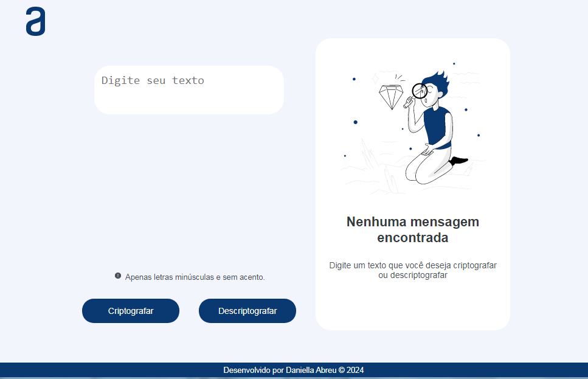
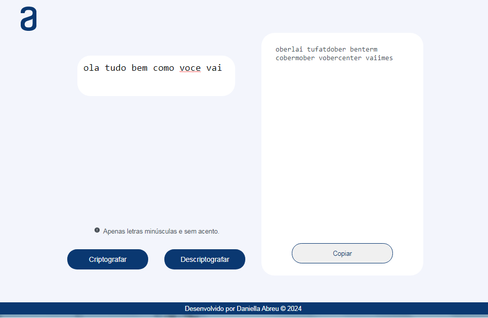

<h1 align="center"> Decodificador de Texto </h1>

#challengeonedecodificador6

Desenvolvido por:
 Daniella Abreu - [Github](https://github.com/danilla94)

## Resumo

Desenvolvido um Decodificador de Texto, tendo como principal objetivo criptografar e descriptografar palavras.

Sobre o desafio:
As "chaves" de criptografia que utilizaremos são:

`A letra "e" é convertida para "enter"`

`A letra "i" é convertida para "imes"`

`A letra "a" é convertida para "ai"`

`A letra "o" é convertida para "ober"`

`A letra "u" é convertida para "ufat"`

Requisitos:

- Deve funcionar apenas com letras minúsculas

- Não devem ser utilizados letras com acentos nem caracteres especiais

- Deve ser possível converter uma palavra para a versão criptografada e também retornar uma palavra criptografada para a versão original.

Por exemplo:

`"gato" => "gaitober"`
`gaitober" => "gato"`

- A página deve ter campos para inserção do texto a ser criptografado ou descriptografado, e a pessoa usuária deve poder escolher entre as duas opções

- O resultado deve ser exibido na tela.

## Objetivos

- HTML
- CSS / Medias Querys
- JavaScript

## Resultado

##### Desktop

###### Proposta
;

###### Resultado Final

##### Mobile

## Tecnologias Utilizadas✅

- [HTML](https://developer.mozilla.org/en-US/docs/Web/HTML)
- [CSS](https://developer.mozilla.org/en-US/docs/Web/CSS)
- [JavaScript](https://developer.mozilla.org/en-US/docs/Web/JavaScript)
- [Google Fonts](https://fonts.google.com/)
- [Mobile First](https://www.moblee.com.br/blog/mobile-first-principais-vantagens)